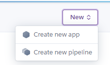
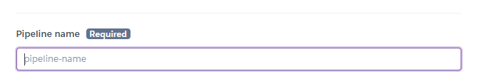
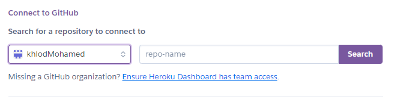
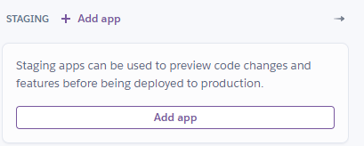
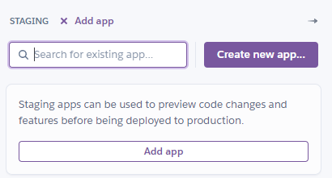
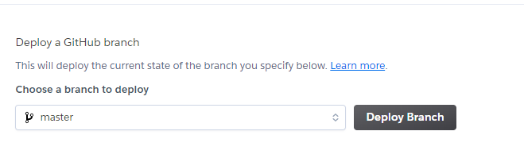

## Table of Contents

- [Prerequisites](#prerequisites)
- [Structure](#structure)
- [Docker Compose](#docker-compose)
- [Heroku](#heroku)
- [How to RUN](#how-to-run)
    - [1. Creat .env file](#1-creat-env-file)
    - [2. Build and play with your docker containers locally](#2-build-and-play-with-your-docker-containers-locally)
    - [3. Create a heroku pipeline](#3-create-a-heroku-pipeline)
    - [4. Create a heroku app](#4-create-a-heroku-app)
    - [5. Deploy your app](#5-deploy-your-app)
    - [6. Go to <<https://<APP_NAME>.herokuapp.com>> and we are done with deployment. 🎉🎉](#6-go-to-httpsapp_nameherokuappcom-and-we-are-done-with-deployment-)

# Prerequisites 

1. Docker 🐳
2. install Heroku CLI
3. Heroku Account

# Structure
1. Streamlit/Dockerfile
2. fastapi/Dockerfile
3. Docker-compose.yml "for local run"
4. heroku.yml

# Docker Compose
docker-compose.yml
* uses ports num from .env file to run locally
  
# Heroku
heroku.yml
* uses  Dockerfile.web instead of using streamlit/Dockerfile

# How to RUN 

### 1. Creat .env file

```bash
PORTStreamlit=8501
PORTFastapi=8000
```

### 2. Build and play with your docker containers locally

```bash
docker-compose up 
```
* open localhost:8501

### 3. Create a heroku pipeline

1. Login to heroku
2. Creat new pipeline



3. Enter your pipeline name



4. connect your pipeline with your github repo


### 4. Create a heroku app

1. Click add app



2. Enter your app name and click create new app



### 5. Deploy your app

1. Go to Deploy tab


2. Scroll down  click on Deploy Branch  


### 6. Go to <<https://<APP_NAME>.herokuapp.com>> and we are done with deployment. 🎉🎉
